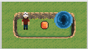
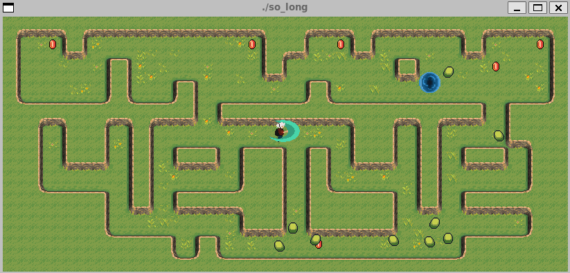
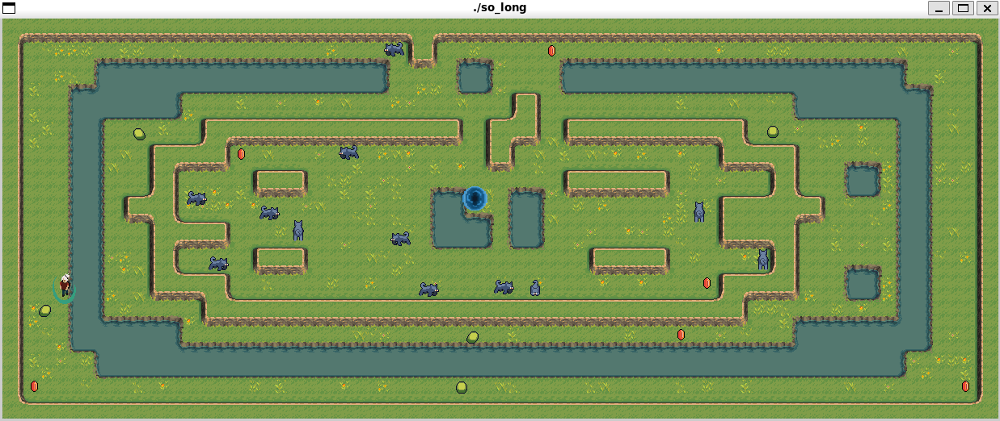
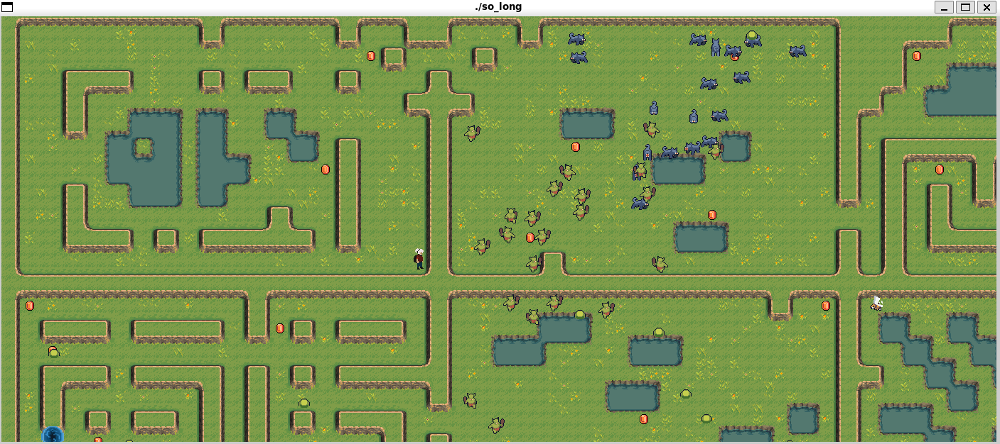

# so_long

**so_long** is a small 2D game developed in C using the MiniLibX (MLX) graphics library.

The player navigates through the map, collects coins and finds the exit, while avoiding (or fighting) enemies that can interact with each other.

This project was developed as part of the 42 school curriculum, but I decided to take it further and implement many features!

---

## Features

- **Beautiful and dynamic map generation** from any `.ber` file of any size!
- **Smooth camera movement** that follows the player naturally
- **Natural enemy AI** — enemies move independently and can fight each other
- **Multiple enemy types** — Slimes, Bees, Wolves, Goblins
- **Collectibles and exit objectives**
- **Dash and attack mechanics**

---

## Installation

### Requirements

- Linux or macOS
- GCC compiler

### Setup

#### Clone the repository

```bash
git clone https://github.com/stanX19/so-long.git so_long
cd so_long
```

#### Clone MinilibX
only if you don't already have it. Ignore the make error when running

```bash
git clone git@github.com:42Paris/minilibx-linux.git mlx_linux
cd mlx_linux
make
cd ..
```

#### Build and run

```bash
make
```

This will compile the project and create the `so_long` executable.

---

## How to Play

### Running the Game

```bash
./so_long <map1.ber> [<map2.ber> ...]
```

You can specify one or multiple `.ber` map files.
The game will load the first map, and automatically continue to the next map after you win.

### Controls

| Key / Mouse         | Action                       |
|:--------------------|:------------------------------|
| W / A / S / D        | Move the player               |
| Space / Left Mouse   | Attack                        |
| Right Mouse + Move   | Dash                          |
| Tab                  | Toggle Dash Mode              |
| R                    | Restart the current map       |
| Esc                  | Quit the game immediately     |

---

## Map Format

Each map is a text file (`.ber`) where each character represents a tile:

| Character | Meaning              |
|:----------|:---------------------|
| `0`       | Walkable path         |
| `1`       | Wall (impassable)     |
| `2`       | Water (impassable)    |
| `P`       | Player start position |
| `E`       | Exit                  |
| `C`       | Collectible (coin)    |
| `S`       | Slime enemy           |
| `B`       | Bee enemy             |
| `W`       | Wolf enemy            |
| `G`       | Goblin enemy          |

Maps must include:
- Exactly one player (`P`)
- Exactly one exit (`E`)
- At least one collectible (`C`)
- A solid wall (`1`) completely surrounding the map

Invalid maps are rejected upon execution.

### Example Map

This simple .ber file example:

```
11111
1PCE1
11111
```

Produces:



---

## Snapshots

### Sample gameplay:

Collecting gold while battling slimes


Beautiful maps from simple .ber files


Boundless ecosystem with enemies fighting each other


---

## Notes

- Built for the 42 school's **so_long** project.
- Focused on gameplay mechanics, dynamic map generation, and enemy ecosystem.
- Some details (such as MLX setup) may vary depending on your system configuration.

---
